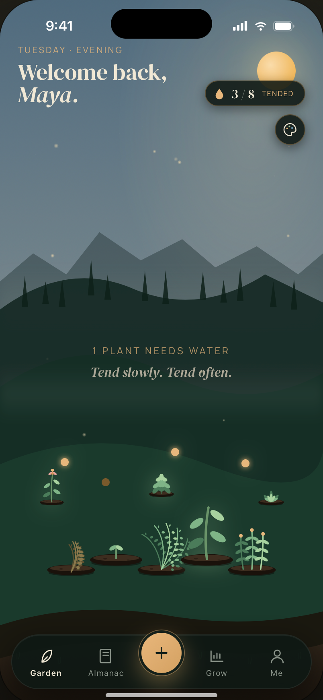
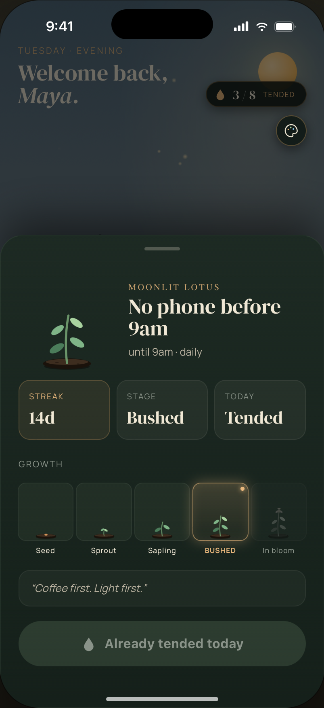
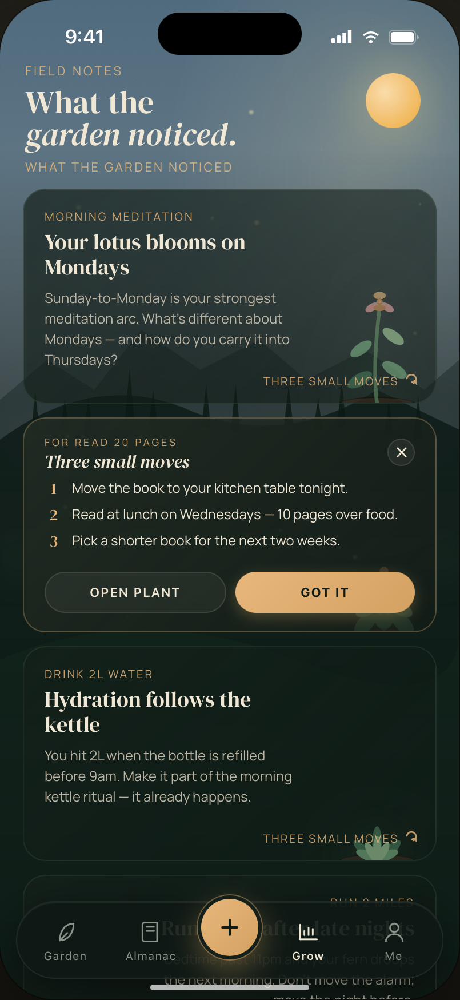
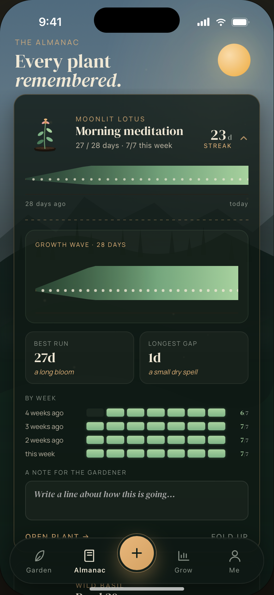

# 🌱 Habit Garden

> **UI/UX Concept & Interactive Demo** — not a production application.

A habit tracker reimagined as a living digital garden. Each habit is a plant: tend to it daily and it grows, blossoms, and thrives. Skip it, and it wilts. Instead of checkboxes and calendar grids, your progress lives in an emotional, visual metaphor you actually want to look at.

---

<table>
  <tr>
    <td></td>
    <td></td>
    <td></td>
    <td></td>
  </tr>
</table>

---

## Concept

Most habit trackers are built around data — streaks, percentages, heatmaps. Habit Garden is built around feeling. The core idea is simple: **your habits should feel alive**.

The garden reflects the real state of your routines. A thriving plant is a habit you've been consistent with. A wilting one is a quiet, visual signal — not a failure notification, not a broken streak counter. Just a plant that needs water.

This approach shifts the emotional framing from *punishment for missing* to *care for something living*.

---

## Key Design Decisions

- **Plant lifecycle as progress metaphor** — habits move through visual states: seed → sprout → growing → blooming → thriving. Each state is earned, not assigned.
- **Wilting instead of resetting** — skipping a habit degrades the plant gradually, not instantly. This mirrors how habits actually work in real life.
- **No numbers on the main view** — the primary interface is purely visual. Data exists, but it doesn't dominate the experience.
- **Interaction through care** — marking a habit as done feels like watering a plant, not checking a box.
- **Ambient garden atmosphere** — the overall composition is designed to feel calm and personal, like tending something that belongs to you.

---

## What's in This Repo

```
/
├── index.html          
├── /docs
│   ├── index.html      # Landing page
│   └── demo.gif        # Demo recording (coming soon)
│   └── /demo
│   │  └── index.html   # Interactive UI/UX concept demo
└── README.md
```

### `index.html` — Concept Demo
The full interactive prototype. Explore the plant growth states, habit interactions, and garden layout. Built with vanilla HTML, CSS, and JavaScript — no dependencies, no build step.

### `/docs/index.html` — Landing Page
A minimal landing page used for the Product Hunt launch and early interest collection. Links to the concept demo and an early access form.

---

## Try It

**[Live Demo](https://dormannilya.github.io/habit-garden-concept/demo/)** | **[Landing Page](https://dormannilya.github.io/habit-garden-concept/)** | **[Product Hunt Page](https://www.producthunt.com/products/habit-garden-grow-better-habits)** | **[Join the waitlist](https://forms.gle/eg2B8UfdrnsjPoYN9)**

---

## Status

This is an **early-stage UI/UX concept** created to test the core interaction model and visual language before committing to a full build.

- [x] Core concept & visual design
- [x] Interactive demo (plant states, habit interactions)
- [x] Product Hunt launch
- [ ] Backend & data persistence
- [ ] Mobile-native version

Interested in where this is going? **[Join the early access list →](https://forms.gle/eg2B8UfdrnsjPoYN9)**

We are testing user interest **[Support the project on Product Hunt →](https://www.producthunt.com/products/habit-garden-grow-better-habits)**

---

## Tech

The demo is intentionally dependency-free:

- Vanilla HTML5, CSS3, JavaScript (ES6+)
- CSS animations & custom properties for plant state transitions
- No frameworks, no build tooling, no external libraries

---

## License

License to be determined. All rights reserved until further notice.

---

<sub>Built as a design exploration. Feedback welcome via Issues.</sub>
